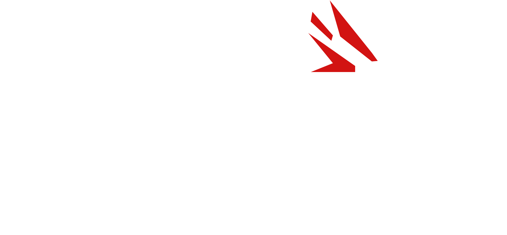

# FORJA Match

<p align="center">
  
</p>

<p align="center">
  <strong>Qual jogo da FORJA dá match com você?</strong>
</p>

<p align="center">
  <a href="LICENSE">
    
  </a>
  <a href="CODE_OF_CONDUCT.md">
    
  </a>
  <a href="https://www.netlify.com/">
    
  </a>
</p>

---

## Sobre o projeto

**FORJA Match** é um jogo web de ativação da [FORJA Game Studio](https://forjagame.com), criado para uso em totens touch durante eventos, exposições e ações institucionais.

A experiência é inspirada em interações de swipe: o jogador recebe frases relacionadas a preferências, mecânicas e dinâmicas de jogos e deve arrastar para a direita ou para a esquerda para indicar se aquela frase combina ou não com ele.

Ao final, o sistema calcula qual jogo da FORJA “dá match” com o perfil do jogador e exibe uma tela de resultado com:

* jogo indicado;
* breve descrição do match;
* local onde jogar;
* localização do estande da FORJA;
* link para acompanhar o jogo nas redes sociais;
* opção de reiniciar a experiência.

O projeto também registra estatísticas anônimas de uso, como sessões iniciadas, respostas dadas, jogos mais indicados e taxa de conclusão.

---

## Objetivos

* Criar uma experiência rápida, visual e divertida para eventos.
* Ajudar visitantes a descobrir jogos da FORJA com base em suas preferências.
* Direcionar o público para jogos e espaços específicos do estande.
* Coletar estatísticas anônimas para análise posterior.
* Funcionar bem em totens touch, mantendo responsividade para outros formatos de tela.

---

## Ambiente ideal de uso

O projeto foi otimizado para totens com as seguintes características:

| Item                | Especificação       |
| ------------------- | ------------------- |
| Sistema             | Android             |
| Entrada             | Touch screen        |
| Resolução ideal     | 1080 × 1920         |
| Orientação          | Vertical / portrait |
| Altura aproximada   | 1,70 m              |

Apesar da otimização para totem, a interface também é responsiva para notebooks, tablets, celulares e monitores horizontais.

---

## Stack

* [Vite](https://vite.dev/) - ambiente de desenvolvimento e build.
* [React](https://react.dev/) - construção da interface.
* CSS puro - layout, identidade visual e animações.
* [Motion](https://motion.dev/) - swipe, drag e animações de card.
* [Firebase Firestore](https://firebase.google.com/docs/firestore) - registro remoto de estatísticas.
* `localStorage` - fallback local para funcionamento sem internet.
* [Netlify](https://www.netlify.com/) - hospedagem e deploy contínuo.

---

## Funcionalidades

* Tela inicial animada com partículas de coração.
* Cards com frases de preferência.
* Interação por swipe horizontal.
* Botões alternativos para aceitar ou recusar frases.
* Algoritmo de match baseado em tags e pesos.
* Tela final com recomendação de jogo.
* Registro anônimo de sessões.
* Sincronização com Firebase Firestore.
* Fallback offline com `localStorage`.
* Tela administrativa para exportação CSV.
* Layout otimizado para totem vertical.
* Deploy automático pela branch `main`.

---

## Estrutura do projeto

```txt
forja-match/
  public/
    assets/
      forja_match_logo.png
      games/

  src/
    components/
      AdminExport.jsx
      GameScreen.jsx
      HeartParticles.jsx
      ResultScreen.jsx
      StartScreen.jsx
      SwipeCard.jsx

    data/
      cards.js
      games.js

    services/
      analytics.js
      firebase.js
      storage.js

    utils/
      csv.js
      match.js

    App.jsx
    main.jsx
    styles.css

  CODE_OF_CONDUCT.md
  LICENSE
  netlify.toml
  package.json
  README.md
```

---

## Pré-requisitos

Antes de iniciar, instale:

* Node.js;
* npm;
* Git.

Verifique a instalação:

```bash
node -v
npm -v
git --version
```

---

## Como rodar localmente

Clone o repositório:

```bash
git clone URL_DO_REPOSITORIO
cd forja-match
```

Instale as dependências:

```bash
npm install
```

Rode o servidor local:

```bash
npm run dev
```

A aplicação ficará disponível, por padrão, em:

```txt
http://localhost:5173
```

---

## Variáveis de ambiente

Crie um arquivo `.env` na raiz do projeto com as credenciais do Firebase:

```env
VITE_FIREBASE_API_KEY=
VITE_FIREBASE_AUTH_DOMAIN=
VITE_FIREBASE_PROJECT_ID=
VITE_FIREBASE_STORAGE_BUCKET=
VITE_FIREBASE_MESSAGING_SENDER_ID=
VITE_FIREBASE_APP_ID=
```

Use o arquivo `.env.example` como referência.

> As variáveis com prefixo `VITE_` são expostas no build frontend. A segurança do Firestore deve ser garantida por regras de acesso no Firebase.

---

## Build de produção

Para gerar a versão de produção:

```bash
npm run build
```

Para testar o build localmente:

```bash
npm run preview
```

---

## Deploy

O projeto está configurado para deploy na Netlify.

Configuração esperada:

```txt
Build command: npm run build
Publish directory: dist
```

O deploy automático deve estar conectado à branch:

```txt
main
```

Assim, todo `push` para `main` gera um novo deploy.

---

## Dados e privacidade

O FORJA Match não coleta nome, e-mail, telefone ou dados pessoais dos jogadores.

As estatísticas registradas são anônimas e incluem informações como:

* ID da sessão;
* horário de início e fim;
* respostas aos cards;
* jogo indicado;
* ranking de pontuação;
* identificação do totem, quando configurada.

Os dados são salvos primeiro localmente no navegador e depois sincronizados com o Firebase Firestore, quando houver conexão disponível.

---

## Tela administrativa

A aplicação possui uma tela administrativa simples para exportação dos dados locais em CSV.

Acesso:

```txt
?admin=1
```

Exemplo:

```txt
http://localhost:5173/?admin=1
```

A tela permite:

* visualizar contagem de sessões locais;
* exportar sessões;
* exportar respostas;
* exportar ranking dos jogos;
* sincronizar sessões pendentes;
* limpar dados locais.

---

## Código de Conduta

Este projeto segue um [Código de Conduta](CODE_OF_CONDUCT.md) para promover um ambiente aberto, respeitoso e acolhedor para pessoas colaboradoras, estudantes, desenvolvedores, designers e demais participantes da comunidade.

---

## Licença

Este projeto é distribuído sob a licença [MIT](LICENSE).

---

## Powered by Netlify

Este projeto é hospedado com apoio da [Netlify](https://www.netlify.com/).

<p>
  <a href="https://www.netlify.com/">
    
  </a>
</p>
